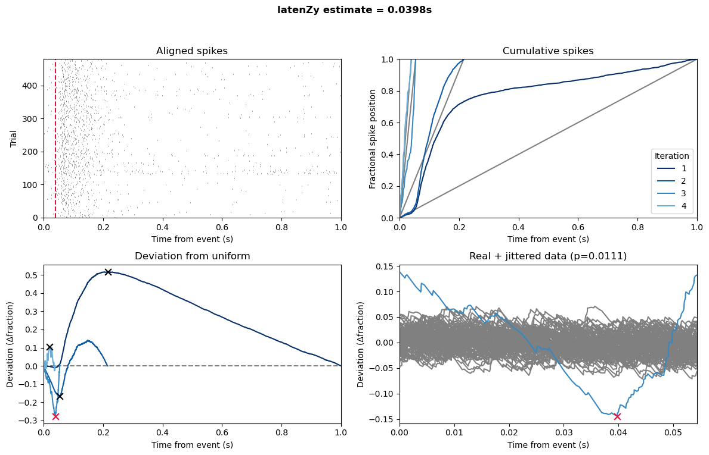

# *latenZy*

Welcome to the ***latenZy*** repository—a Python and MATLAB toolbox containing two non-parametric, binning-free methods for estimating the onset of neural spiking activity with high temporal precision: ***`latenZy`*** and ***`latenZy2`***. 

These methods leverage the cumulative distribution of spike times to detect time-locked changes in neural firing without relying on predefined time bins. Through an iterative process that identifies statistically significant deviations from a linear baseline—whether aligned to a single event or contrasting experimental conditions—this framework provides robust, data-driven estimates of when neural activity begins to change, without making assumptions about the response pattern.

**If you use *latenZy* in your work, please cite the paper:** Haak R., Heimel J. A. (2025). *LatenZy: non-parametric, binning-free estimation of latencies from neural spiking data.* *Journal of Neurophysiology*. [https://doi.org/10.1152/jn.00332.2025](https://doi.org/10.1152/jn.00332.2025)

## Estimating response latencies with ***`latenZy`***
***`latenZy`*** is designed to estimate **when neural responses begin following discrete events** (e.g., stimulus onset) by detecting event-locked changes in spiking rates. 


**Python example:**
```python
from latenzy import latenzy

t, s_latenzy = latenzy(spike_times, event_times, use_dur)
print(f"Estimated latency: {t:.2f} ms")
```

**MATLAB example:**
```matlab
[t, sLatenzy] = latenzy(spikeTimes, eventTimes, useDur);
fprintf('Estimated latency: %.2f ms\n', t);
```

`use_dur`/`useDur` is a window around the event times (e.g., [-0.1 1] or 1 when only including post-event time)


*Detecting neural spiking onset using `latenZy` (Python example). Red = estimate.*


## Estimating when spiking starts to diverge between conditions with ***`latenZy2`***
***`latenZy2`*** identifies the time point at which neural spiking **begins to diverge between experimental conditions** (e.g., hit vs miss or attended vs unattended).
  
**Python example:**
```python
from latenzy import latenzy2

t, s_latenzy2 = latenzy2(spike_times1, event_times1, spike_times2, event_times2, use_dur)
print(f"Estimated latency: {t:.2f} ms")
```

**MATLAB example:**
```matlab
[t, sLatenzy2] = latenzy2(spikeTimes1, eventTimes1, spikeTimes2, eventTimes2, useDur);
fprintf('Estimated latency: %.2f ms\n', t);
```

`use_dur`/`useDur` is a window around the event times (e.g., [-0.1 1] or 1 when only including post-event time)


*Detecting the onset of spiking divergence using `latenZy2` (Python example) Red = estimate.*

## Python installation
To install this package globally in editable mode so you can use it anywhere, run:

```shell
cd python
pip install -e.
```

## Preparing your data
***`latenZy`*** requires continuous spike and event times in absolute timestamps. If your data is trial-aligned (spikes relative to stimulus onset) and lacks original event times, you must reconstruct absolute spike times and provide the corresponding event timestamps. ***`latenZy2`*** accepts trial-aligned data directly. See the [Preprocessing guidelines](./data_preparation.md) for detailed instructions. 

## Dependencies
The Python implementation requires the following packages to work:
- NumPy
- SciPy
- Matplotlib
- Optional: concurrent.futures to reduce computation time

The MATLAB implementation requires the following Mathworks toolboxes to work:
- Signal Processing Toolbox
- Optional: Parallel Computing Toolbox to reduce computation time

